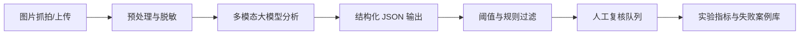

# 室内办公图片抓拍风险行为智能分析技术预研报告

## 1. 预研目标

本预研验证“云端多模态大模型 + 图片抓拍 + 结构化风险判断”是否能支撑室内办公重点场所的人员风险行为智能分析。目标不是直接替代安防人员或管理制度，而是判断该路线能否形成低成本、可解释、可复核的风险提示能力。

预研优先回答四个问题：

1. 单张室内办公图片中，模型能否稳定识别可见人员、场景和明确风险迹象。
2. 对“疑似冲突、倒地、吸烟、禁区人员、资料拍摄、摄像头遮挡”等风险，模型能否给出可见证据和置信度。
3. 使用强 JSON Schema 约束后，结果是否能稳定进入后续规则引擎、告警系统和人工复核流程。
4. 在脱敏或模拟数据上验证后，是否值得进入轻量 PoC 开发。

## 2. 场景与边界

适用场景：

- 办公区、会议室、走廊、前台、大厅、机房门口、档案室门口、仓库门口等固定摄像头抓拍。
- 图片来自历史抓拍、事件截帧或人工上传，非第一阶段实时视频流。
- 输出用于风险提示和人工复核，不用于自动处罚、身份确认、绩效评估或法律定性。

明确不做：

- 不做人脸识别、身份识别、跨摄像头追踪。
- 不基于外貌、年龄、性别、民族等敏感属性做判断。
- 不判断人员主观动机、情绪状态或法律责任。
- 不对单帧无法确认的行为给出确定性结论。

## 3. 推荐技术架构

关键策略：

- 图片预处理：压缩到模型适配尺寸，去除无关元数据，必要时做脸部/屏幕局部模糊。
- 模型分析：同时要求“场景描述、可见证据、风险类型、严重程度、置信度、不可判断项”。
- 结构化输出：使用 JSON Schema 或等效约束，避免自由文本难以统计。
- 阈值过滤：只把高置信风险或中高严重度风险进入告警/复核，低置信内容作为观察项。
- 人工闭环：复核结果反哺提示词、标签定义、阈值和困难负样本集。

## 4. 风险标签体系

第一版只覆盖单张图片可见或可疑判断的综合风险：

| 风险类型 | 代码 | 默认严重度 | 判定要求 |
| --- | --- | --- | --- |
| 人员倒地/异常姿态 | `fall_or_abnormal_posture` | high | 人员躺倒、蜷缩、姿态明显异常，且可见身体轮廓 |
| 疑似冲突/拉扯 | `conflict_or_physical_altercation` | high | 有推搡、拉扯、围堵、肢体冲突迹象 |
| 室内吸烟/明火 | `smoking_or_open_flame` | high | 可见香烟、烟雾、打火机火焰或明火 |
| 禁区/敏感区域人员出现 | `restricted_area_presence` | medium | 人员出现在机房、档案室、仓库等标注区域 |
| 多人异常聚集 | `unusual_gathering` | medium | 人员数量和空间关系明显异常，需结合区域规则 |
| 摄像头遮挡/画面异常 | `camera_obstruction_or_tamper` | high | 画面被遮挡、偏转、强光干扰或局部异常遮盖 |
| 疑似拍摄屏幕/白板/资料 | `possible_sensitive_material_capture` | medium | 可见手机/相机对准屏幕、白板、文档等 |
| 工牌/访客证明显缺失 | `badge_or_visitor_pass_missing` | low | 只在画质足够且制度要求明确时启用 |

所有风险必须包含可见证据。若证据不足，输出 `needs_review=true`，并在 `unsupported_claims` 中说明不能确认的原因。

## 5. 模型与接口路线

建议至少对比两个云端多模态模型：

- 主路线：支持图片输入和结构化输出的通用 VLM。OpenAI Responses API 支持文本和图片输入，Structured Outputs 可用 JSON Schema 约束输出。
- 备选路线：Gemini 图像理解能力可作为云端对比路线，其视频理解能力可作为后续从图片抓拍扩展到短视频/长视频时的参考。
- 国产化/私有化参考：Qwen3-VL 支持图像和视频理解，可作为后续本地化或专有云部署路线评估对象。

参考资料：

- [OpenAI Responses API](https://platform.openai.com/docs/api-reference/responses)
- [OpenAI Images and Vision](https://platform.openai.com/docs/guides/images-vision)
- [OpenAI Structured Outputs](https://platform.openai.com/docs/guides/structured-outputs)
- [Gemini Image Understanding](https://ai.google.dev/gemini-api/docs/vision)
- [Gemini Video Understanding](https://ai.google.dev/gemini-api/docs/video-understanding)
- [Qwen3-VL](https://github.com/QwenLM/Qwen3-VL)

## 6. 实验设计

### 6.1 数据集

最小评测集建议 150-300 张图片：

- 正常办公样本：约 40%，如开会、办公、通行、访客接待。
- 明确风险样本：约 40%，覆盖倒地、吸烟、冲突、遮挡、禁区、资料拍摄等。
- 困难负样本：约 20%，如正常递物被误判为拉扯、喝水被误判为吸烟、多人开会被误判为聚集。

每张图片需人工标注：

- `image_id`
- `scene_type`
- `people_count_range`
- `expected_risks`
- `severity`
- `must_review`
- `visible_evidence`
- `privacy_status`

### 6.2 实验组

1. 零样本提示词：验证基础视觉理解和风险判断能力。
2. 少样本提示词：加入正常样本、明确风险、困难负样本示例，验证误报改善。
3. 强结构化 schema：使用响应 JSON Schema，验证接口稳定性和可统计性。

### 6.3 评价指标

| 指标 | 目标值 | 说明 |
| --- | ---: | --- |
| 高置信告警准确率 | >= 85% | 高置信告警中真实风险占比 |
| 正常样本误报率 | <= 10% | 无风险样本被高置信告警比例 |
| 漏报率 | 越低越好 | 有风险样本未被高置信识别比例 |
| 结构化输出稳定率 | >= 99% | 输出可解析且关键字段齐全 |
| 人工复核命中率 | 越高越好 | 进入复核队列的样本中真实风险占比 |
| 平均响应时间 | 记录即可 | 按模型、图片尺寸和并发量统计 |
| 单张成本 | 记录即可 | 估算日调用量和月成本 |

## 7. 可行性判定

通过条件：

- 高置信告警准确率不低于 85%。
- 正常样本误报率不高于 10%。
- 结构化输出稳定率不低于 99%。
- 高风险结论均能给出图片中可见证据。
- 模型对身份、动机、情绪、法律责任等不可见信息不做臆测。

不通过或暂缓条件：

- 明显风险识别不稳定，尤其是倒地、烟火、冲突和遮挡。
- 大量正常办公行为被误报，且少样本提示词和阈值策略不能明显改善。
- 输出经常不符合结构化接口，导致无法稳定接入后续系统。
- 云端合规、成本或延迟无法满足业务约束。

## 8. 预研结论模板

结论应按以下格式填写：

- `可行`：建议进入轻量 PoC，构建上传/批量分析/人工复核界面。
- `有条件可行`：限定风险类型或场景后进入 PoC，例如先做倒地、遮挡、烟火三类高确定性风险。
- `暂不建议`：模型误报、漏报、成本、隐私或稳定性问题尚未满足进入开发条件。

当前默认判断：该路线适合先做“风险提示 + 人工复核”的辅助分析系统，不适合做全自动处罚或确定性安防判定。

